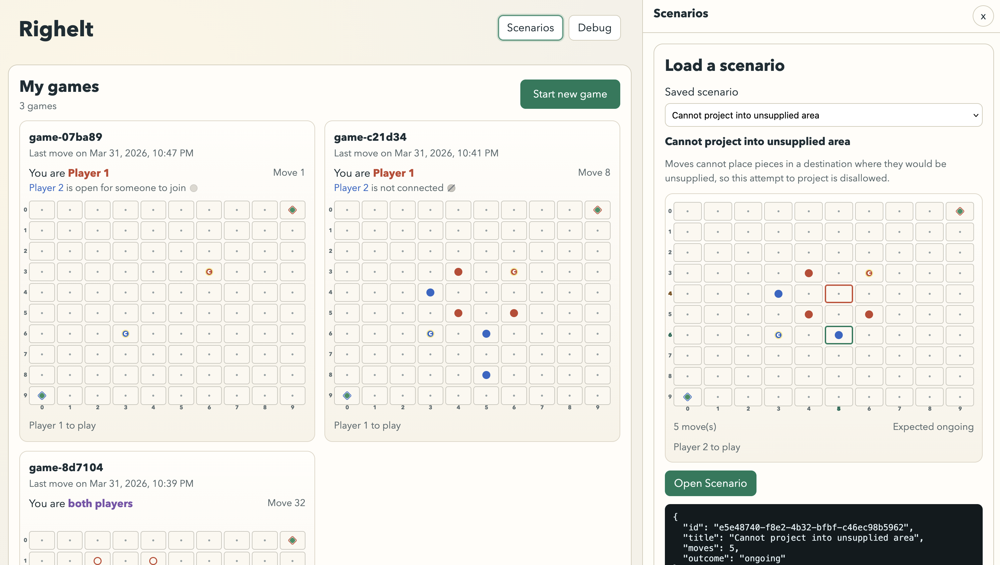
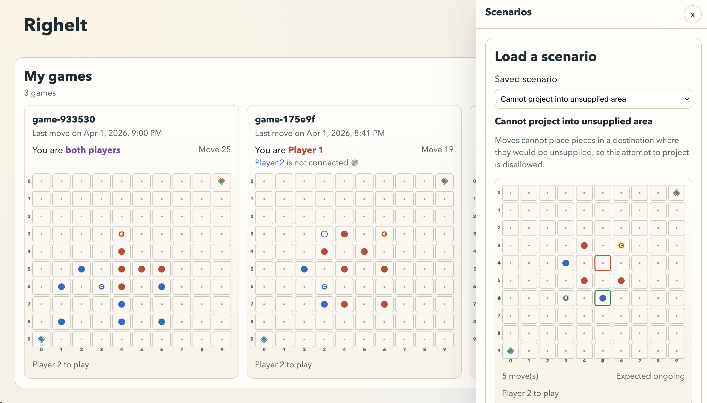

## Description

<!-- SECTION:DESCRIPTION:BEGIN -->
Notion priority: P2.

**Expected behavior:**

**Incorrect behavior (intermediate width — pops from bottom, does not push main content):**

<!-- SECTION:DESCRIPTION:END -->
