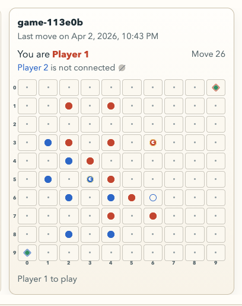

## Description

<!-- SECTION:DESCRIPTION:BEGIN -->
Example hitting this error: https://righelt.pages.dev/#/game/game-113e0b8273e45851d105b1b25b0700943e36

Snapshot of corresponding game card: 

Error: {
  "wallTime": 2282,
  "cpuTime": 1,
  "truncated": false,
  "executionModel": "stateless",
  "outcome": "exception",
  "scriptVersion": {
    "id": "9197b8ad-ffd1-405d-ad75-4811ff112133"
  },
  "scriptName": "pages-worker--11205377-production",
  "diagnosticsChannelEvents": [],
  "exceptions": [
    {
      "stack": "    at async next (functionsWorker-0.23635008651624023.js:495:26)\n    at async Object.fetch (functionsWorker-0.23635008651624023.js:509:14)",
      "name": "Error",
      "message": "Worker exceeded CPU time limit.",
      "timestamp": 1775284957862
    }
  ],
  "logs": [],
  "eventTimestamp": 1775284955572,
  "event": {
    "request": {
      "url": "https://righelt.pages.dev/api/shell/games/game-113e0b8273e45851d105b1b25b0700943e36?identityId=id-euwoc5mb",
      "method": "GET",
      "headers": {
        "accept": "*/*",
        "accept-encoding": "gzip, br",
        "accept-language": "en-CA,en-US;q=0.9,en;q=0.8",
        "cache-control": "no-cache",
        "cf-connecting-ip": "2600:4040:976f:a900:9022:d4c:6dca:2f7",
        "cf-ipcountry": "US",
        "cf-ray": "9e6e557c4953f25f",
        "cf-visitor": "{\"scheme\":\"https\"}",
        "connection": "Keep-Alive",
        "dnt": "1",
        "host": "righelt.pages.dev",
        "pragma": "no-cache",
        "priority": "u=4",
        "referer": "https://righelt.pages.dev/",
        "sec-fetch-dest": "empty",
        "sec-fetch-mode": "cors",
        "sec-fetch-site": "same-origin",
        "user-agent": "Mozilla/5.0 (Macintosh; Intel Mac OS X 10.15; rv:148.0) Gecko/20100101 Firefox/148.0",
        "x-forwarded-proto": "https",
        "x-real-ip": "2600:4040:976f:a900:9022:d4c:6dca:2f7"
      },
      "cf": {
        "httpProtocol": "HTTP/3",
        "clientAcceptEncoding": "gzip, deflate, br",
        "requestPriority": "",
        "edgeRequestKeepAliveStatus": 1,
        "requestHeaderNames": {},
        "clientTcpRtt": 0,
        "clientQuicRtt": 7,
        "colo": "EWR",
        "asn": 701,
        "asOrganization": "Verizon Business",
        "country": "US",
        "isEUCountry": false,
        "city": "New York City",
        "continent": "NA",
        "region": "New York",
        "regionCode": "NY",
        "timezone": "America/New_York",
        "longitude": "-74.00597",
        "latitude": "40.71427",
        "postalCode": "10001",
        "metroCode": "501",
        "tlsVersion": "TLSv1.3",
        "tlsCipher": "AEAD-AES128-GCM-SHA256",
        "tlsClientRandom": "d6rv95g3B+v1Y+wuTirulv0PdwAVE2x/Ag+csUtiZag=",
        "tlsClientCiphersSha1": "majgAKUWrKK75XCpDQDr/Sf7Eyw=",
        "tlsClientExtensionsSha1": "bRm95p5TEVSfJnVpCqdZgapqhFU=",
        "tlsClientExtensionsSha1Le": "+mLjXuur6b8svMJvivAoRV7jK50=",
        "tlsExportedAuthenticator": {
          "clientHandshake": "9c87ddbfe1db8e98dd48b55280ba48157d8ef14c3b07c51a31e30d942afb5f1d",
          "serverHandshake": "0b1fcce55dbd2c14dadd3aeb8b657e0b5009ac47cb0b7d0e968d76026c7c7483",
          "clientFinished": "866208bb8c1e8fa6ac5ad4816549588164117c844a4f9bfa1874cce39e9cf7ce",
          "serverFinished": "f2a09caa7ffbb3177ef2d4af249224e726f90136c5afdfe3df9abd1463a477c7"
        },
        "tlsClientHelloLength": "2351",
        "tlsClientAuth": {
          "certPresented": "0",
          "certVerified": "NONE",
          "certRevoked": "0",
          "certIssuerDN": "",
          "certSubjectDN": "",
          "certIssuerDNRFC2253": "",
          "certSubjectDNRFC2253": "",
          "certIssuerDNLegacy": "",
          "certSubjectDNLegacy": "",
          "certSerial": "",
          "certIssuerSerial": "",
          "certSKI": "",
          "certIssuerSKI": "",
          "certFingerprintSHA1": "",
          "certFingerprintSHA256": "",
          "certNotBefore": "",
          "certNotAfter": "",
          "certRFC9440": "",
          "certRFC9440TooLarge": false,
          "certChainRFC9440": "",
          "certChainRFC9440TooLarge": false
        },
        "verifiedBotCategory": "",
        "edgeL4": {
          "deliveryRate": 3932693
        },
        "pagesHostName": "righelt.pages.dev",
        "botManagement": {
          "corporateProxy": false,
          "verifiedBot": false,
          "jsDetection": {
            "passed": false
          },
          "staticResource": false,
          "detectionIds": {},
          "score": 99
        }
      }
    },
    "response": {
      "status": 503
    }
  },
  "id": 1
}
<!-- SECTION:DESCRIPTION:END -->
